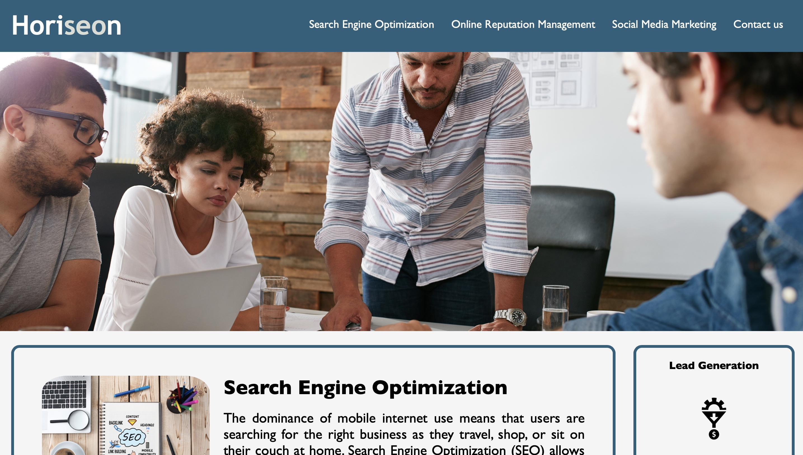

# Horiseon-challenge-wk1
This is the challenge of week 1 of the BootCamp from University of Birmingham

**User Story**

AS A marketing agency
I WANT a codebase that follows accessibility standards SO THAT our own site is optimized for search engines

**Technology**

This project was developed using only HTML and CSS files - with the addition of the README file.

**Acceptance Criteria**

The website was delivered with the head not named properly, so the first amend was to add the company name "Horiseon". Then, looking into the top menu, I have added a "contact us" section for clients if they want to get in contact with the company. Also, removed the esclamation mark on 'social media marketing" to make it consistent.

Also, I have significantly reduce the height of the main image because it was causing the visitors to scroll too much to reach the text. Then, I have changed the background colour to white, and the body text in black. This is to make sure that everyone is able to read as we need to make sure we think about people who might are not able to read coloured text with a coloured background. 

I have made the paragraphs text bigger to make it more readable, and removed the background but added a border and coloured it with the themed blue of the company.

All of the images have been Alt texted so can facilitate the SEO and help special needs people when browsing. 

Made the footer text smaller as it was too big. 

**Review**

URL: http://127.0.0.1:5555/index.html#search-engine-optimization
GitHub URL: https://github.com/antoninogambino/Horiseon-challenge-wk1.git
GitHib deployed repository: https://antoninogambino.github.io/Horiseon-challenge-wk1/

**Deployed website screenshot**

